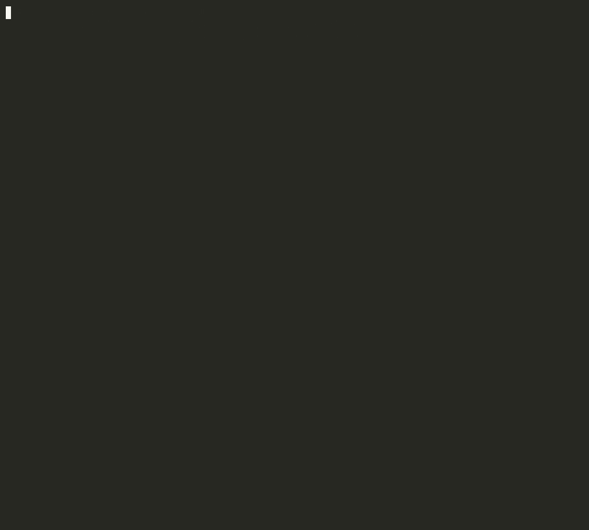
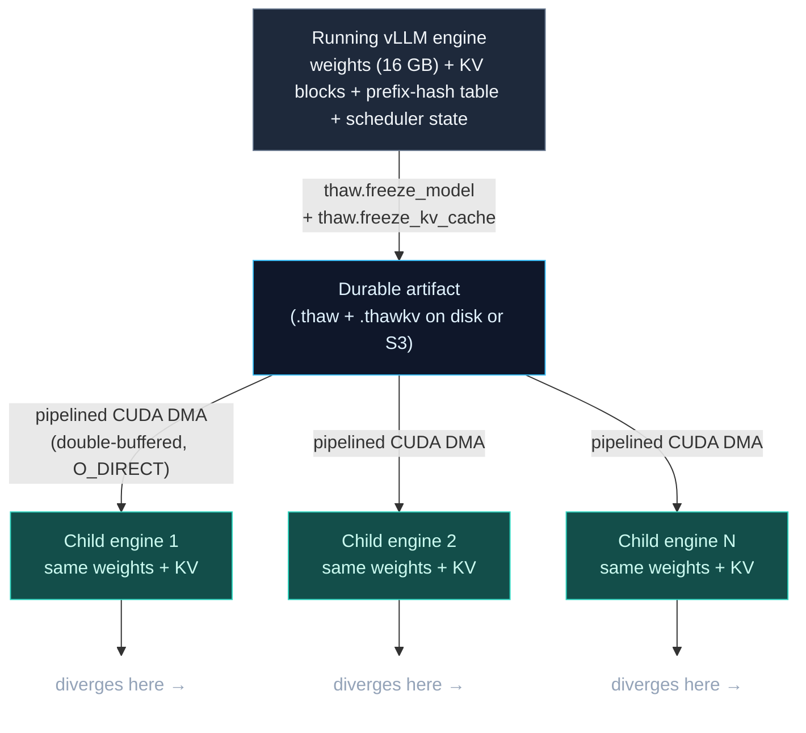
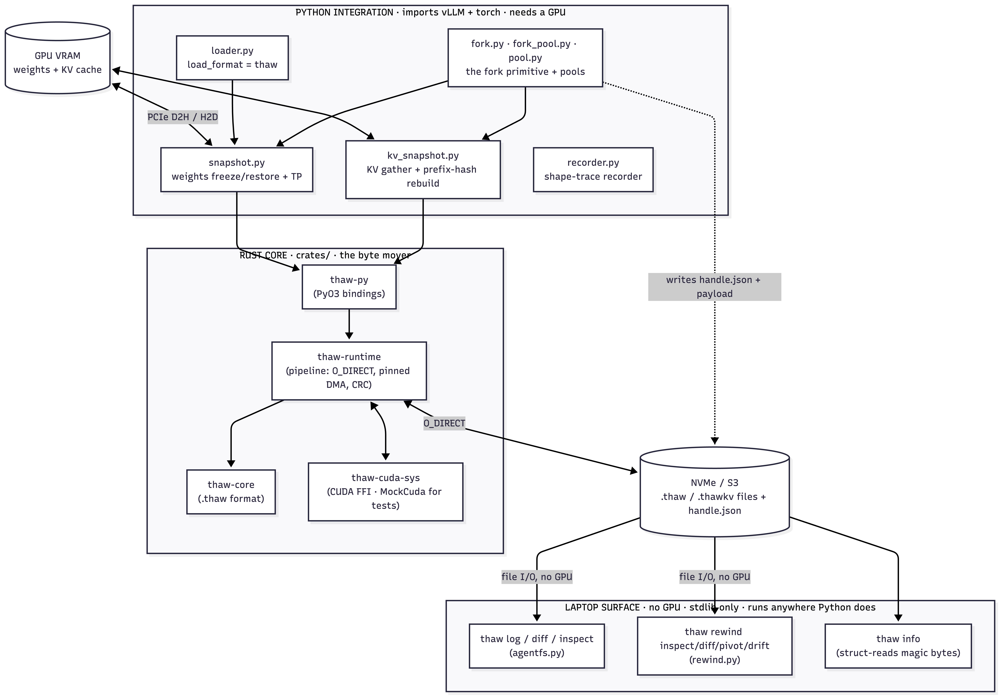

<p align="center">
  
</p>

# thaw

[](https://pypi.org/project/thaw-vllm/)
[](https://pypi.org/project/thaw-vllm/)
[](https://github.com/thaw-ai/thaw/actions/workflows/test.yml)
[](https://www.apache.org/licenses/LICENSE-2.0)
[](https://pepy.tech/project/thaw-vllm)
[](https://arxiv.org/abs/2606.15621)

**git for live LLM agent sessions.**

An agent's KV cache — its working memory — normally dies with the process. thaw turns a running **vLLM** or **SGLang** session into a *durable file* you can `checkpoint`, `branch`, `diff`, `checkout`, and `log` — like git, but for a living agent.

The part most tools miss: **inspecting, diffing, and tracing sessions needs no GPU** — only `checkout` (rehydrating onto a GPU) does. So the everyday loop runs on your laptop.

## See it in 10 seconds — no GPU

```bash
git clone https://github.com/thaw-ai/thaw && cd thaw
pip install thaw-vllm          # installs the `thaw` CLI; inspect/diff/log use no GPU
thaw diff examples/pr-review-fanout/reviewer-security \
          examples/pr-review-fanout/reviewer-style
```

```
thaw diff
  A  reviewer-security
  B  reviewer-style
  model        same  (facebook/opt-125m)
  shared kv    13/13 blocks identical  (~208 tokens)
  text split   first 195 tokens identical, diverge at token 195
  A diverges   …security vulnerabilities.
  B diverges   …code style and naming.
```

Two reviewers forked from the **same** pull-request context — and you can see *exactly* where they diverged. `thaw log` prints the lineage tree; `thaw inspect <handle>` shows what's inside one. All three run on a laptop, in milliseconds.

<p align="center">
  
</p>

<p align="center"><sub>▶ <a href="https://youtu.be/zPmuvSKWrSY">75-second demo</a> · <a href="https://youtu.be/aLF3lIuBeBY">how it works (4m)</a> · <a href="https://youtu.be/Fzk8sVGgi1g">fork a running agent (2m 20s)</a></sub></p>

## The verbs

| verb | what it does | needs a GPU? |
|---|---|---|
| `thaw checkpoint` | freeze a live session to a portable handle (≈ `git commit`) | yes |
| `thaw branch` | fork a handle into a divergent child (≈ `git branch`) | no \* |
| `thaw checkout` | hydrate a handle into an engine, skipping prefill (≈ `git checkout`) | yes |
| `thaw inspect` | what's in a session — model, prefix, KV, text preview | **no** |
| `thaw diff` | what diverged between two sessions — shared KV + the split point | **no** |
| `thaw log` | the lineage tree of your handles | **no** |

<sub>\* Branching an existing handle is pure file I/O. Forking a *live* engine is the GPU `checkpoint` path.</sub>

```bash
pip install thaw-vllm[vllm]   # add the engine to checkpoint / checkout on a GPU
```

And it's fast where it counts: a pre-warmed pool forks at **0.88s/round** (≈400× over cold-boot) on an H100 with Llama-3.1-8B — see [Performance](#performance).

## Who it's for

- **RL post-training teams.** PPO, DPO, tree-GRPO, and best-of-N loops fork rollouts from a shared trunk and pay for prefill on every branch. A step with 16 rollouts goes from ~90 minutes to ~15 seconds. HuggingFace's 2026 async-RL survey: *"no current async library supports [KV pivot resampling] out of the box."* This ships it.
- **Coding-agent teams.** Parallel-exploration products (Cursor-style N approaches, SWE-bench agents) pay a prefill tax on every branch. ForkPool turns "explore 8 approaches" from 8× full prefill into an 8-branch fork against one warm KV state.
- **Platform + framework teams.** `thaw.fork(llm)` returns a portable, serializable handle you can ship across processes and pods — session migration, multi-model hot-swap, replay — without rewriting your inference layer. Drop-in for LangGraph nodes, Modal functions, Ray workers.

**Not for you yet:** single-prompt serving — one request, one response, no shared trunk — where vLLM / SGLang alone are fine. thaw earns its keep when you fork ≥2 children from shared state or hot-swap between sessions.

Works with vLLM and SGLang. Open source (Apache-2.0).

## Performance

**ForkPool — Llama-3.1-8B on H100 80 GB, 5 rounds × 4 branches × 64 tokens** (a pre-warmed subprocess pool holds the engine once; each fork snapshots KV only):

| Stage | Time |
|---|---|
| `init_pool` (one-time — workers boot with real weights) | 22.3s |
| First fork round | 1.16s |
| **Median fork round** | **0.88s** |

Per-round cost: ~340s cold-boot → sub-second (≈400× amortized). All rounds 4/4 non-empty and divergent, bit-identical at the fork boundary. Reproducer: [`demos/fork_pool_rl.py`](demos/fork_pool_rl.py) · receipt: [`site/receipts/2026-04-20_h100_fork_pool_rl.json`](site/receipts/2026-04-20_h100_fork_pool_rl.json)

**Sleep / wake round-trip** (vLLM native `LLM.sleep(level=2)` + `LLM.wake_up()` composed with thaw's snapshot — bit-identical greedy output both sides):

| Config | Sleep | Wake | Snapshot | `CuMemAllocator` freed |
|---|---|---|---|---|
| Llama-3.1-8B, 1× H100 SXM, TP=1 | **3.4s** | **11.1s** | 16 GB, 195 regions | 45.38 GiB |
| Llama-3.1-70B, 2× H100 SXM, TP=2 | **16.1s** | **53.6s** | 141 GB, 966 regions | 72.67 GiB/rank (145 GiB total) |

**Slot-warm hot-swap** (`thaw serve`, H100 SXM Llama-3-8B): one-time `cudaHostRegister` pin ~6s, then **0.29s / 55 GB/s** per reload (86% of PCIe Gen5 line rate). Extrapolates to ~2.5s for a 70B at 140 GB.

Every other "fast model loading" tool restores weights only. thaw restores the full state of a live inference session — weights + KV blocks + prefix-hash table + scheduler state — and that's what makes fork work. All paths produce **bit-identical** output.

> Numbers are per-pod; freeze-side throughput is NVMe-bound, not code-bound. Re-measure on your own pod before citing a ceiling. Methodology and the full receipt set: [`docs/BENCHMARKS.md`](docs/BENCHMARKS.md).

## Rewind — RL rollouts in logprob space

`thaw rewind` is the rollout-level companion to the session verbs: capture N sampled continuations from a trunk (with per-token logprobs), then find where they diverge and which one the model was most confident in — on a laptop, no GPU. `rewind diff` shows the pivot token and the logprob each branch assigned the *other's* pick; `rewind pivot` ranks N rollouts by sequence logprob; `rewind inspect` scores one.

8 best-of-N reasoning rollouts from Qwen2.5-7B are checked in — try it with no GPU:

```bash
thaw rewind pivot examples/rewind-bestof8
thaw rewind diff  examples/rewind-bestof8/rollout-2 examples/rewind-bestof8/rollout-3
```

Validated end-to-end on an A100 (Qwen2.5-7B best-of-8) — [docs/REWIND_VALIDATION.md](docs/REWIND_VALIDATION.md). Reproduce the capture: [`demos/rewind_bestof8.py`](demos/rewind_bestof8.py).

## How fork works

**Fork** is a composition of four primitives: freeze weights, freeze KV cache, freeze scheduler state, restore all three into a fresh process.



Restore initializes a fresh engine with dummy weights (no disk I/O), overwrites them from the snapshot via double-buffered pipelined DMA through pinned host memory, then rebuilds the prefix-cache block table from the `.thawkv` sidecar — so requests matching the restored prefix skip prefill entirely. The **KV cache snapshot** is the hard part: vLLM's prefix-cache hash table maps token-hash → block-id, and thaw serializes the block contents, the hash table, and the scheduler's view of which blocks are cached, then rebuilds it on the other side. Nobody else transports a live cache between engines.

Restore modes, the zero-copy pinned-mmap path, sleep-mode integration ([vLLM RFC #34303](https://github.com/vllm-project/vllm/issues/34303)), and the on-disk format are documented in [**docs/ARCHITECTURE.md**](docs/ARCHITECTURE.md).

## Architecture

<p align="center">
  
</p>

<sub>The split that matters: the GPU path (Python + Rust) <b>writes</b> the file; the laptop surface <b>reads</b> it. <code>log</code>, <code>diff</code>, <code>inspect</code>, and <code>rewind</code> never touch a GPU.</sub>

A Rust core (file format + pipelined DMA + O_DIRECT, `MockCuda` so it tests on a Mac) under PyO3 bindings, with Python integration for vLLM/SGLang and the GPU-free CLI surface. Full crate/module layout: [docs/ARCHITECTURE.md](docs/ARCHITECTURE.md).

## Quick start

```bash
pip install thaw-vllm[all]      # Python package + FastAPI server + pre-built Rust/CUDA wheel
```

**Fork a running agent** — the core capability, in one call:

```python
import thaw_vllm
from vllm import LLM, SamplingParams

# Run an agent until a pivot point
llm = LLM(model="meta-llama/Meta-Llama-3-8B-Instruct", enable_prefix_caching=True)
llm.generate([reasoning_trunk], SamplingParams(max_tokens=200))

# Fan out — N parallel approaches, each hydrates from one shared snapshot,
# zero reprefill of the trunk
results = thaw_vllm.fork_completions(
    llm,
    prompts=[trunk + hint for hint in branch_hints],
    sampling_params=SamplingParams(temperature=0.9, max_tokens=512),
    workers=4,
)
```

**For RL loops** — boot the pool once, fork repeatedly at sub-second cost:

```python
from thaw_vllm import ForkPool

pool = ForkPool()
pool.init_pool(model="meta-llama/Meta-Llama-3.1-8B-Instruct", workers=4, preload_weights=True)

for epoch in range(num_epochs):
    results = thaw_vllm.fork_completions(llm, prompts, sampling_params, pool=pool)  # ~0.88s/round
    rewards = score(results)
    ...   # PPO / best-of-N / tree-GRPO step
```

**Or persist the handle yourself:**

```python
with thaw_vllm.fork(llm, include_weights=True) as handle:
    handle.save("s3://my-bucket/session-abc123/")   # ship it anywhere
    stats = handle.hydrate(other_llm)               # or restore in-place
```

<details>
<summary><b>Server mode (OpenAI-compatible), Python API, multi-GPU, S3, SGLang, LangGraph, CLI</b></summary>

### Server mode

`thaw serve` is PgBouncer for GPU inference: it keeps vLLM engines pre-initialized with dummy weights, then DMA-swaps real weights from a snapshot on demand. First swap into a slot pays the one-time pin (~6s/16 GB); every swap after runs at **55 GB/s (0.29s for 8B)**.

```bash
huggingface-cli login                                                   # gated models
thaw freeze --model meta-llama/Llama-3.1-8B-Instruct --output weights.thaw
thaw serve  --model meta-llama/Llama-3.1-8B-Instruct --snapshot weights.thaw
# OpenAI-compatible API now at http://localhost:8000/v1
```

```bash
# Multi-model pool with warm slots; the request's `model` field selects the snapshot
thaw serve --model meta-llama/Llama-3.1-8B-Instruct --snapshot base.thaw \
  --pool-size 2 --register finetune-v2=/snapshots/v2.thaw
```

`/v1/completions`, `/v1/chat/completions` (SSE streaming), `/admin/snapshots` (hot-register), `/admin/pool` (status). Model affinity means an already-loaded model has zero swap cost.

### Python API

```python
import thaw_vllm
from vllm import LLM

# Freeze weights to a snapshot (CLI), then restore in one call:
#   $ thaw freeze --model meta-llama/Meta-Llama-3-8B --output /path/weights.thaw
llm = thaw_vllm.load("meta-llama/Meta-Llama-3-8B", "/path/weights.thaw")

# Or use the native vLLM loader directly
llm = LLM(model="meta-llama/Meta-Llama-3-8B", load_format="thaw",
          model_loader_extra_config={"snapshot": "/path/weights.thaw"})
```

### Multi-GPU (tensor parallel)

```python
llm = LLM(model="meta-llama/Meta-Llama-3-70B-Instruct", tensor_parallel_size=2)
thaw_vllm.freeze_model_tp(llm, "/path/weights.thaw")          # weights.thaw + weights.rank1.thaw
llm = thaw_vllm.load("meta-llama/Meta-Llama-3-70B-Instruct", "/path/weights.thaw",
                     tensor_parallel_size=2)
```

### Cloud storage (S3) — `pip install thaw-vllm[cloud]`

```python
llm = thaw_vllm.load("meta-llama/Meta-Llama-3-8B", "s3://my-bucket/llama-3-8b.thaw")
```

First call downloads to `~/.cache/thaw/snapshots/` (override `THAW_CACHE_DIR`); later calls hit the cache. TP per-rank URIs are derived automatically. Credentials come from the standard boto3 chain.

### SGLang — `pip install thaw-vllm[sglang]`

```python
import sglang
from thaw_sglang import ThawSGLangModelLoader

engine = sglang.Engine(model_path="meta-llama/Meta-Llama-3-8B",
                       load_format=ThawSGLangModelLoader,
                       model_loader_extra_config={"snapshot": "/path/weights.thaw"},
                       dtype="float16")
```

TP works automatically (each worker loads its rank). Note: vLLM and SGLang can't coexist in one env (torch conflict) — use separate pods.

### LangGraph — `pip install thaw-vllm[langgraph]`

```python
from thaw_vllm.langgraph import ChatThaw, fork_fanout

llm = ChatThaw(model="meta-llama/Llama-3.1-8B-Instruct", workers=2)
response = await llm.ainvoke(messages)                                  # drop-in BaseChatModel
texts = await fork_fanout(llm, prefix_messages, [suffix_a, suffix_b])   # explicit fork
```

**Important:** parent and pool workers must boot with the same dtype — pass matching `{"dtype": "float16"}` (or `"bfloat16"`) via `extra_llm_kwargs` / `extra_pool_kwargs`. Mismatches corrupt snapshotted KV and produce garbage on rounds 1+.

### CLI reference

```bash
# offline — no GPU
thaw inspect HANDLE_DIR              # model, prefix, KV, text preview
thaw diff    HANDLE_A HANDLE_B       # shared KV blocks + the token/text split point
thaw log     DIR                     # lineage tree (checkpoint → branches)
thaw info    SNAPSHOT.thaw           # low-level .thaw / .thawkv file info
thaw rewind  diff|pivot|inspect ...  # RL rollout inspection in logprob space

# GPU
thaw freeze --model meta-llama/Meta-Llama-3-8B --output weights.thaw
thaw serve  --model meta-llama/Meta-Llama-3-8B --snapshot weights.thaw [--pool-size N] [--register NAME=PATH]
```

The git-style Python API mirrors this: `thaw_vllm.checkpoint(llm, prompt=…, label=…)`, `handle.branch(dir, label=…)`, `thaw_vllm.checkout(handle, llm)`.

</details>

<details>
<summary>Working demos &amp; troubleshooting</summary>

**Demos** — [`pr_review_langgraph.py`](demos/pr_review_langgraph.py) (4-specialist PR review, `--mode thaw` vs `--mode baseline`), [`rl_rollout_simulator.py`](demos/rl_rollout_simulator.py) (tree-GRPO pivot resampling, 16 rollouts), [`parallel_agents.py`](demos/parallel_agents.py) (8 coding approaches ranked by pytest pass rate), [`agent_fork.py`](demos/agent_fork.py) (the launch-video session clone).

**`hf-xet` download crash** — `export HF_HUB_DISABLE_XET=1` if you hit `Data processing error: File reconstruction error`.
**Disk space** — `[all]` + an 8B snapshot needs ~50 GB; use ≥100 GB container disk.
**Gated models** — run `huggingface-cli login` before freeze/serve.

**Build from source** (custom CUDA): `pip install "maturin[patchelf]" vllm && maturin build --release --features cuda -m crates/thaw-py/Cargo.toml -o /tmp/wheels && pip install /tmp/wheels/*.whl`.

</details>

## How thaw compares

Lots of work in adjacent spaces — fastsafetensors, NVIDIA Model Streamer, vLLM Sleep Mode, Modal Snapshots, LMCache / Dynamo, InferX — but none **fork a live session at the GPU-state layer**. What thaw uniquely owns:

1. **Fork as a primitive.** Nobody else snapshots the combined weights + KV cache + prefix-hash table + scheduler state of a live engine and restores it into a fresh process. This is what makes agent branching, RL rollout dedup, and session migration work.
2. **KV cache snapshot with prefix-hash reconstruction.** LMCache / Dynamo tier KV blocks for their *own* cache; they don't let you transport a cache between engines. thaw does.
3. **One `.thaw` file, two engines** (vLLM + SGLang), on commodity hardware (55 GB/s slot-warm, no GDS / RAID).

LMCache / Tensormesh is a server-side cache-tiering *proxy* — passive, request-driven. thaw is an *imperative primitive* your code calls at a pivot: `fork(llm) → handle` returns a portable reference any process can hydrate. Different product, different buyer. Full capability matrix: [**docs/LANDSCAPE.md**](docs/LANDSCAPE.md).

## Roadmap

Shipped: the fork primitive, KV-cache snapshot/restore, multi-GPU TP (bit-exact on 2×H100 + 2×A40), SGLang, ForkPool (0.88s/round), sleep-mode + [vLLM RFC #34303](https://github.com/vllm-project/vllm/issues/34303) evidence, LangGraph, S3, pre-built wheels.

Next: a versioned engine-tagged format spec, cross-engine restore (freeze in vLLM, checkout in SGLang), `thaw verify`, and shard-parallel cloud restore. Tracked on the [**roadmap board**](https://github.com/orgs/thaw-ai/projects/1).

## Docs

[Architecture & format](docs/ARCHITECTURE.md) · [Benchmarks & methodology](docs/BENCHMARKS.md) · [Competitive landscape](docs/LANDSCAPE.md) · [Rewind validation](docs/REWIND_VALIDATION.md) · [Paper (arXiv)](https://arxiv.org/abs/2606.15621)

## Get in touch

Built by Nils Matteson in Madison, WI.

- **Evaluating for a real workload?** Email [nils@thaw.sh](mailto:nils@thaw.sh) — include your rollout shape or fork pattern and we'll help you wire it up.
- **Training RL models or running parallel agents at scale?** DM on LinkedIn: [Nils Matteson](https://www.linkedin.com/in/nilsmatteson/).
- **Bug, feature, or question?** [GitHub issues](https://github.com/thaw-ai/thaw/issues).

⭐ [Star on GitHub](https://github.com/thaw-ai/thaw) if you're watching this space.

## License

Apache License 2.0 — see [LICENSE](./LICENSE).
