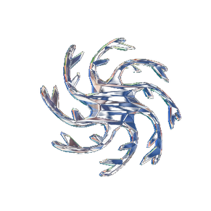
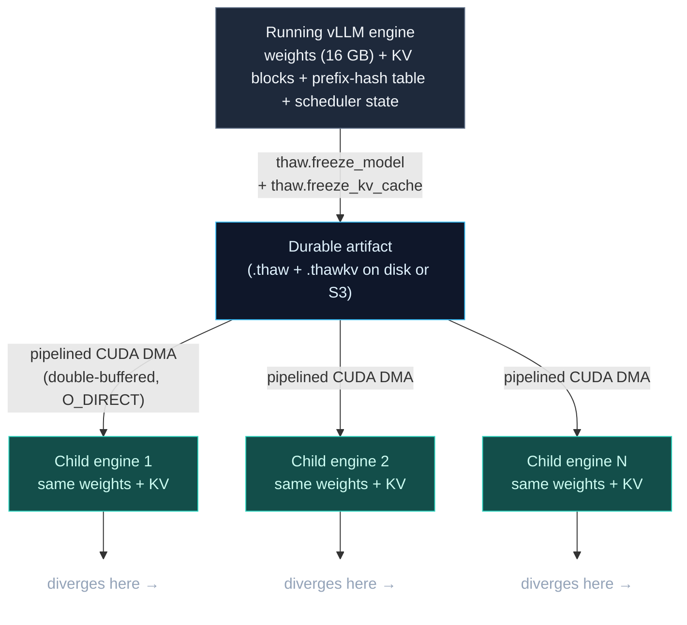
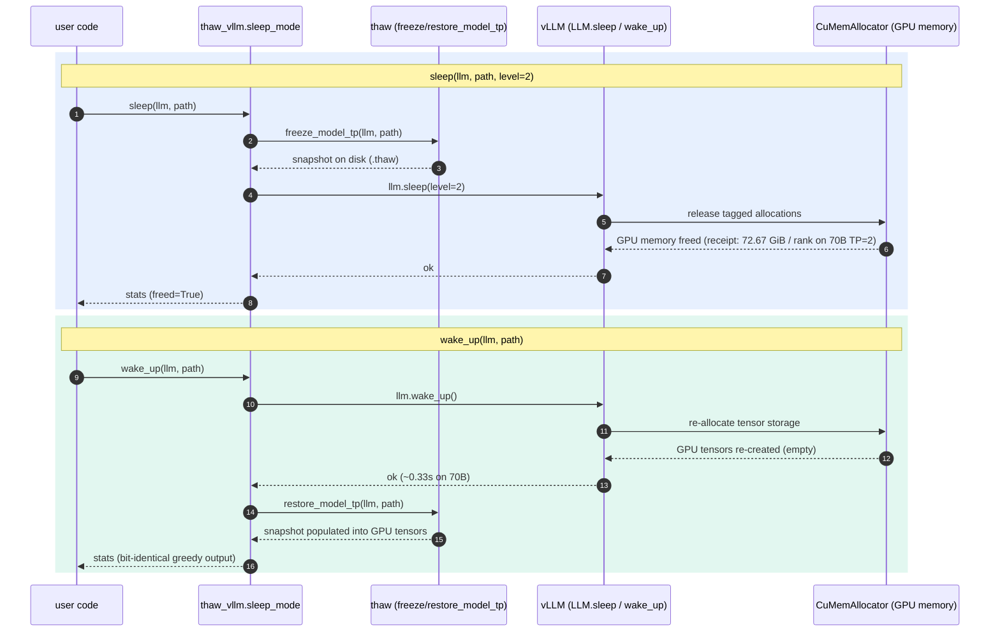

<p align="center">
  
</p>

# thaw

[](https://pypi.org/project/thaw-vllm/)
[](https://pypi.org/project/thaw-vllm/)
[](https://github.com/thaw-ai/thaw/actions/workflows/test.yml)
[](https://www.apache.org/licenses/LICENSE-2.0)
[](https://pepy.tech/project/thaw-vllm)

**The fork primitive for LLM inference.**

Snapshot a running AI agent — weights, KV cache, scheduler state, and prefix-hash table — into a single durable file. Restore it. Fork it N times. Each child shares the parent's state at the fork point and diverges from there. `git branch` for live GPU inference.

```bash
pip install thaw-vllm
```

### The receipt — ForkPool, 2026-04-20

Pre-warmed subprocess pool holds the engine once; each `fork_completions()` call snapshots KV only.

**Llama-3.1-8B on H100 80 GB PCIe, 5 rounds × 4 branches × 64 tokens:**

| Stage | Time |
|---|---|
| `init_pool` (one-time — workers boot with real weights) | 22.3s |
| First fork round | 1.16s |
| **Median fork round** | **0.88s** |

Per-round cost: ~340s cold-boot → sub-second (≈400× amortized). All rounds 4/4 non-empty and divergent. Bit-identical at the fork boundary. The first sub-second fork amortization proof on real hardware.

Reproducer: [`demos/fork_pool_rl.py`](demos/fork_pool_rl.py) · Receipt JSON: [`site/receipts/2026-04-20_h100_fork_pool_rl.json`](site/receipts/2026-04-20_h100_fork_pool_rl.json)

### What you can build with it

- **Agent branching** — fork a conversation into N parallel hypotheses mid-reasoning, run them concurrently, pick the winner.
- **RL rollouts** — collapse `num_rollouts × prefill_time` to `num_rollouts × memcpy_time`. Real dollars on $100k+/month training budgets. HuggingFace's 2026 async-RL survey: *"no current async library supports [KV pivot resampling] out of the box."* This ships it.
- **Parallel coding agents** — turn "8 agents exploring 8 solutions" from an expensive re-prefill tax into a fast primitive.
- **Session migration** — move a live inference session between GPUs, pods, or data centers without losing state.

### Who this is for

**RL post-training teams.** PPO, DPO, tree-GRPO, and best-of-N loops that fork rollouts from a shared trunk pay for prefill on every branch. The receipt above takes a round from ~340s cold-boot to 0.88s warm-pool. A step with 16 rollouts: ~90 minutes → ~15 seconds. Multiply by steps × epochs. HuggingFace's 2026 async-RL survey documented the gap: *"no current async library supports [KV pivot resampling] out of the box."*

**Coding-agent teams.** Parallel-exploration products — Cursor-style N approaches, SWE-bench agents, test-driven coding loops — pay a prefill tax on every branch. ForkPool turns "explore 8 approaches" from 8× full prefill into an 8-branch fork against one warm KV state. More hypotheses per user request at the same GPU spend.

**Platform + framework teams.** `thaw.fork(llm)` returns a portable, serializable handle you can ship across processes and pods. Session migration, multi-model hot-swap, session replay — without rewriting your inference layer. Drop-in for LangGraph nodes, Modal functions, Ray workers.

**Not for you yet.** Single-prompt serving — one request, one response, no shared trunk, no repeated forking — vLLM / SGLang alone are fine. thaw earns its keep when you fork ≥2 children from shared state or hot-swap between sessions.

Works with vLLM and SGLang. Open source (Apache-2.0).

<p align="center">
  <a href="https://youtu.be/zPmuvSKWrSY">
    
  </a>
  <br>
  <sub><b>▶ 75-second demo</b> — <a href="https://youtu.be/zPmuvSKWrSY">Hot-swap LLMs in 0.29s</a> · <a href="https://youtu.be/aLF3lIuBeBY">How it works (4m)</a> · <a href="https://youtu.be/Fzk8sVGgi1g">Fork a running agent (2m 20s)</a></sub>
</p>

## Inside a single fork

ForkPool amortizes setup cost across repeated forks. Each primitive behind it is receipted individually.

**Sleep / wake round-trip** (vLLM native `LLM.sleep(level=2)` + `LLM.wake_up()` composed with thaw's snapshot — bit-identical greedy output both sides):

| Config | Sleep | Wake | Snapshot | `CuMemAllocator` freed | Receipt |
|---|---|---|---|---|---|
| Llama-3.1-8B, 1× H100 SXM, TP=1 | **3.4s** | **11.1s** | 16 GB, 195 regions | 45.38 GiB | [`sleep_mode_8b_tp1.json`](site/receipts/2026-04-22_rfc/sleep_mode_8b_tp1.json) |
| Llama-3.1-70B, 2× H100 SXM, TP=2 | **16.1s** | **53.6s** | 141 GB, 966 regions | 72.67 GiB/rank (145 GiB total) | [`sleep_mode_70b_tp2.json`](site/receipts/2026-04-22_rfc/sleep_mode_70b_tp2.json) |

**Slot-warm hot-swap** (`thaw serve` with a persisted pinned mmap, H100 SXM Llama-3-8B): one-time `cudaHostRegister` pin ~6s, then **0.29s / 55 GB/s** per reload (86% of PCIe Gen5 line rate). Reproducer: [`bench_slot_warm.py`](bench_slot_warm.py), correctness: [`bench_slot_warm_correctness.py`](bench_slot_warm_correctness.py). Extrapolates to ~2.5s hot-swap for a 70B at 140 GB.

Every other "fast model loading" tool restores weights only. thaw restores the full state of a live inference session — weights + KV blocks + prefix-hash table + scheduler state — and that's what makes fork work.

> Numbers are per-pod; freeze-side throughput is NVMe-bound (not code-bound). Re-measure on your own pod before citing as a ceiling. Methodology: [`docs/BENCHMARKS.md`](docs/BENCHMARKS.md).
>
> A pre-staged RAM path (mmap + `cudaHostRegister`) exists behind `THAW_ZEROCOPY_MMAP=1`. `cudaHostRegister` is O(pages) — pinning a 16 GB mmap costs ~7s, so the path is only a win when amortized across many restores (what `thaw serve` does by persisting the pin on each slot).

All paths produce **bit-identical** inference output. KV cache restore preserves prefix cache across cold starts — new requests skip prefill entirely.

## How it works

**Fork** is a composition of four primitives: freeze weights, freeze KV cache, freeze scheduler state, restore all three into a fresh process. None of that was possible at GPU speeds before thaw.



**Freeze** captures the full engine state into two binary files: `.thaw` (weights) and `.thawkv` (KV blocks + prefix-hash table + scheduler metadata).

**Restore** initializes a fresh vLLM engine with dummy weights (fast — no disk I/O), overwrites them from the snapshot via double-buffered pipelined DMA through pinned host memory, then rebuilds the prefix-cache block table from the `.thawkv` sidecar. Two CUDA streams overlap PCIe transfers with disk reads. New requests matching the restored prefix skip prefill entirely.

Three restore modes:
- **Disk**: reads snapshot from NVMe with O_DIRECT, bypassing the kernel page cache. Throughput is NVMe-bound; re-measure per pod before citing a ceiling.
- **Pre-staged RAM**: snapshot already in memory (tmpfs, shared memory, or mmapped with page cache warm). The full zero-copy path (mmap + `cudaHostRegister`) is implemented behind `THAW_ZEROCOPY_MMAP=1`, but the one-time registration cost makes it a win only when amortized across many restores.
- **Slot-warm hot-swap (`thaw serve`)**: when a pool slot warms up, `thaw serve` pins the snapshot mmap once (~6s `cudaHostRegister` for 16 GB) and persists the pinned handle on the slot. Every subsequent model swap into that slot reuses the pinned buffer and runs as pure PCIe DMA — 0.29s at 55 GB/s for an 8B model on H100 SXM.

**KV cache snapshots** are the hard part. vLLM's prefix-cache hash table maps token-hash → block-id, and the scheduler assumes those block assignments are live. thaw serializes the block contents, the hash table, and the scheduler's view of which blocks are cached. On restore, the block data is DMA'd back to GPU and the hash table is rebuilt — so a request whose prefix was cached in the parent immediately hits cache in the child. Nobody else does this.

### Sleep-mode integration (vLLM RFC #34303)

`thaw_vllm.sleep_mode` composes thaw's freeze/restore around vLLM's native `LLM.sleep(level=2)` + `LLM.wake_up()` — not a parallel path: `sleep()` freezes *then* lets vLLM's `CuMemAllocator` free the GPU memory; `wake_up()` re-allocates the tensor storage *then* thaw populates it. Requires `enable_sleep_mode=True` at LLM construction (strict-mode gate).



Receipts (2× H100 SXM, bit-identical greedy output on both ends): [`sleep_mode_8b_tp1.json`](site/receipts/2026-04-22_rfc/sleep_mode_8b_tp1.json), [`sleep_mode_70b_tp2.json`](site/receipts/2026-04-22_rfc/sleep_mode_70b_tp2.json). Source: [`python/thaw_vllm/sleep_mode.py`](python/thaw_vllm/sleep_mode.py). Tests: [`tests/test_sleep_mode.py`](tests/test_sleep_mode.py) (8 passing, CPU-only).

```python
from vllm import LLM
import thaw_vllm.sleep_mode as sm

llm = LLM(model="meta-llama/Meta-Llama-3.1-8B-Instruct",
          enable_sleep_mode=True,           # required by the strict-mode gate
          enforce_eager=True, dtype="float16")

llm.generate(["hello"])                      # warm the engine

sm.sleep(llm, "/snap/llama8b.thaw")          # freeze then llm.sleep(level=2)
# GPU memory is actually freed here — not just tagged

sm.wake_up(llm, "/snap/llama8b.thaw")        # llm.wake_up() then restore
llm.generate(["hello"])                      # bit-identical tokens
```

## Architecture

```
thaw/
  crates/
    thaw-core/       Rust. File format, region tables, I/O. No CUDA dep.
    thaw-cuda-sys/   Rust. FFI bindings to CUDA runtime (cudaMallocHost,
                     cudaMemcpyAsync, streams). Built via build.rs.
    thaw-runtime/    Rust. Orchestration: freeze/restore pipelines, double-
                     buffered DMA, O_DIRECT, thread-local WC-buffer cache,
                     unified zero-copy/staging restore. MockCuda for Mac.
    thaw-py/         Rust. PyO3 bindings exposing pipelined freeze/restore
                     to Python. Builds a native .so via maturin.
    thaw-cli/        Rust. thaw-bench-freeze binary + internal tooling.
  python/
    thaw_common/     Engine-agnostic freeze/restore primitives (shared).
    thaw_vllm/       vLLM integration + engine pool + OpenAI server.
      snapshot.py    vLLM TP freeze/restore via collective_rpc.
      kv_snapshot.py KV cache freeze/restore (pipelined path, .meta sidecar).
      loader.py      vLLM ModelLoader: load_format="thaw".
      pool.py        Engine pool: pre-warmed slots, model hot-swap.
      server.py      OpenAI-compatible API server.
      cli.py         CLI: thaw freeze, thaw serve, thaw info.
    thaw_sglang/     SGLang integration (class-passthrough loader).
    vllm_demo.py     End-to-end benchmark: normal vs thaw cold start.
    kv_cache_demo.py KV cache snapshot/restore demo with correctness test.
  demos/
    agent_fork.py    Agent fork demo: clone session, fork parallel completions.
```

**Testing on Mac, shipping on GPU.** The `CudaBackend` trait abstracts all GPU operations. `MockCuda` (a HashMap-backed fake) lets 48 runtime tests run on any machine. The `cuda` feature flag activates real GPU paths only when needed.

## Quick start

```bash
pip install thaw-vllm[all]
```

This installs the Python package, FastAPI server, and pre-built Rust+CUDA native extension. No Rust toolchain needed.

### Fork a running AI agent

The core capability, in one call:

```python
import thaw_vllm
from vllm import LLM, SamplingParams

# Load and run an agent until you hit a pivot point
llm = LLM(model="meta-llama/Meta-Llama-3-8B-Instruct",
          enable_prefix_caching=True)
llm.generate([reasoning_trunk], SamplingParams(max_tokens=200))

# Fan out from that pivot — 8 parallel approaches in subprocess workers,
# each hydrates from one shared snapshot, zero reprefill of the trunk.
results = thaw_vllm.fork_completions(
    llm,
    prompts=[trunk + hint for hint in branch_hints],
    sampling_params=SamplingParams(temperature=0.9, max_tokens=512),
    workers=4,
)
for r in results:
    print(r.worker_index, r.text[:200])
```

Prefer the primitive when you want to persist, move, or hand off the
handle yourself:

```python
with thaw_vllm.fork(llm, include_weights=True) as handle:
    handle.save("s3://my-bucket/session-abc123/")       # ship it anywhere
    stats = handle.hydrate(other_llm)                    # or restore in-place
```

For RL training loops — boot the engine pool once, fork repeatedly at sub-second cost:

```python
from thaw_vllm import ForkPool

pool = ForkPool()
pool.init_pool(                      # one-time, ~22s on H100 8B
    model="meta-llama/Meta-Llama-3.1-8B-Instruct",
    workers=4,
    preload_weights=True,            # workers hold real weights; fork swaps only KV
)

for epoch in range(num_epochs):
    # Each call reuses the warm pool — ~0.88s median per round on H100 8B
    results = thaw_vllm.fork_completions(llm, prompts, sampling_params, pool=pool)
    rewards = score(results)
    ...                              # PPO / best-of-N / tree-GRPO step
```

### LangGraph: one import, fork as a first-class primitive

Agent frameworks erase the "N branches share a system prompt" signal — by the time `Send()` fans out, each branch looks independent. `thaw_vllm.langgraph` gives you two entry points: a LangChain-compatible chat model, and an explicit fork primitive you can call from any node.

```python
# Install: pip install thaw-vllm[langgraph]
from thaw_vllm.langgraph import ChatThaw, fork_fanout

llm = ChatThaw(model="meta-llama/Llama-3.1-8B-Instruct", workers=2)

# 1. Drop-in chat model — concurrent ainvoke calls are coalesced into
#    one batched vLLM.generate (continuous batching). Use this wherever
#    LangGraph expects a BaseChatModel.
response = await llm.ainvoke(messages)

# 2. Explicit fan-out — snapshots the parent's KV over `prefix` once
#    and fans out N divergent suffixes through the ForkPool. This is
#    the path that hits sub-second amortized fork latency.
texts = await fork_fanout(llm, prefix_messages, [suffix_a, suffix_b, suffix_c, suffix_d])
```

**Important:** parent and pool workers must boot with the same dtype. `ChatThaw` accepts `extra_llm_kwargs` / `extra_pool_kwargs` — pass matching `{"dtype": "float16"}` (or `"bfloat16"`) to both. Mismatches corrupt snapshotted KV cache blocks and produce garbage on rounds 1+.

Working demos ship in the repo:

- [`demos/pr_review_langgraph.py`](demos/pr_review_langgraph.py) — 4-specialist PR review (security / performance / style / correctness) against a shared diff + codebase context. `--mode thaw` routes the fan-out through ForkPool; `--mode baseline` runs the same graph against a stock single-call path for side-by-side timing.
- [`demos/rl_rollout_simulator.py`](demos/rl_rollout_simulator.py) — Tree-GRPO-style pivot resampling. Builds a reasoning trunk, forks 16 rollouts, scores each. The table it prints is the arithmetic HuggingFace's async-RL survey said no library ships: `num_rollouts × prefill → num_rollouts × memcpy`.
- [`demos/parallel_agents.py`](demos/parallel_agents.py) — 8 parallel coding approaches from one reasoning trunk, ranked by pytest pass rate. The Cursor/Cognition reframe.
- [`demos/agent_fork.py`](demos/agent_fork.py) — the original end-to-end session-clone demo used in the launch video.

### Server mode (OpenAI-compatible)

**Freeze a model, then serve it:**

```bash
# Llama models are gated — authenticate with HuggingFace first
huggingface-cli login

# Step 1: Freeze model weights to a snapshot
thaw freeze --model meta-llama/Llama-3.1-8B-Instruct --output weights.thaw

# Step 2: Serve with pre-warmed engine pool
thaw serve --model meta-llama/Llama-3.1-8B-Instruct --snapshot weights.thaw
```

That's it. You now have an OpenAI-compatible API at `http://localhost:8000/v1`:

```bash
curl http://localhost:8000/v1/chat/completions \
  -H "Content-Type: application/json" \
  -d '{"model": "meta-llama/Llama-3.1-8B-Instruct",
       "messages": [{"role": "user", "content": "Hello!"}],
       "max_tokens": 64}'
```

### How `thaw serve` works

`thaw serve` is PgBouncer for GPU inference. It keeps vLLM engines pre-initialized with dummy weights, then DMA-swaps real model weights from a snapshot on demand. First swap into a slot pays the one-time `cudaHostRegister` pin cost (~6s for 16 GB); every subsequent swap runs at **55 GB/s (0.29s for 8B, ~2.5s for 70B)** — that's the pinned mmap reused through PCIe Gen5 DMA without ever leaving the slot.

- **OpenAI-compatible API** — `/v1/completions`, `/v1/chat/completions`, streaming via SSE
- **Model affinity** — requests for an already-loaded model have zero swap cost
- **Hot model registration** — register new snapshots at runtime via `/admin/snapshots`
- **Pool status** — monitor slots, loaded models, and utilization via `/admin/pool`

```bash
# Multi-model pool with 2 warm slots
thaw serve --model meta-llama/Llama-3.1-8B-Instruct \
  --snapshot base.thaw \
  --pool-size 2 \
  --register finetune-v2=/snapshots/v2.thaw

# The model field in each request selects which snapshot to serve
curl localhost:8000/v1/completions -d '{"model": "finetune-v2", "prompt": "..."}'
```

### Python API

```python
import thaw_vllm
from vllm import LLM, SamplingParams

# Freeze: save model weights to a snapshot
llm = LLM(model="meta-llama/Meta-Llama-3-8B", dtype="float16", enforce_eager=True)
thaw_vllm.freeze_model_pipelined(model, "/path/to/weights.thaw")

# Restore: one call
llm = thaw_vllm.load("meta-llama/Meta-Llama-3-8B", "/path/to/weights.thaw")
```

Or use `load_format="thaw"` directly with vLLM:

```python
import thaw_vllm  # registers the loader
llm = LLM(model="meta-llama/Meta-Llama-3-8B",
          load_format="thaw",
          model_loader_extra_config={"snapshot": "/path/to/weights.thaw"})
```

**Multi-GPU** — tensor parallel with per-rank snapshots:

```python
# Freeze: each GPU saves its shard
llm = LLM(model="meta-llama/Meta-Llama-3-70B-Instruct", tensor_parallel_size=2, ...)
thaw_vllm.freeze_model_tp(llm, "/path/to/weights.thaw")
# Creates: weights.thaw (rank 0), weights.rank1.thaw (rank 1)

# Restore: skip the disk-bottlenecked safetensors load
llm = thaw_vllm.load("meta-llama/Meta-Llama-3-70B-Instruct", "/path/to/weights.thaw",
                      tensor_parallel_size=2)
```

**Cloud storage (S3)** — load snapshots directly from S3 URIs (install with `pip install thaw-vllm[cloud]`):

```python
# Freeze once, upload to S3, restore anywhere
llm = thaw_vllm.load("meta-llama/Meta-Llama-3-8B",
                     "s3://my-bucket/llama-3-8b.thaw")
```

First call downloads to `~/.cache/thaw/snapshots/` (override with `THAW_CACHE_DIR`); subsequent calls hit the local cache. For TP, per-rank files live at `s3://bucket/weights.thaw` and `s3://bucket/weights.rank1.thaw` — thaw derives the per-rank URIs automatically. AWS credentials come from the standard boto3 chain (env vars, `~/.aws/credentials`, IAM role).

**SGLang** — same API, class-passthrough loader (install with `pip install thaw-vllm[sglang]`):

```python
import sglang
from thaw_sglang import ThawSGLangModelLoader

engine = sglang.Engine(
    model_path="meta-llama/Meta-Llama-3-8B",
    load_format=ThawSGLangModelLoader,
    model_loader_extra_config={"snapshot": "/path/to/weights.thaw"},
    dtype="float16",
)
```

TP works automatically — each SGLang worker loads its own rank-specific snapshot. Freeze via `thaw freeze --engine sglang ...` or `ThawSGLangFreezeLoader`. Note: vLLM and SGLang cannot coexist in one env (torch version conflict) — use separate pods.

**Agent fork demo** — clone a running AI session, fork parallel completions:

```bash
python demos/agent_fork.py --snapshot weights.thaw
python demos/agent_fork.py --snapshot weights.thaw --full-cycle  # destroy + restore
```

### CLI reference

```bash
thaw freeze --model meta-llama/Meta-Llama-3-8B --output weights.thaw
thaw serve  --model meta-llama/Meta-Llama-3-8B --snapshot weights.thaw [--pool-size N] [--register NAME=PATH]
thaw info   weights.thaw
```

<details>
<summary>Troubleshooting</summary>

**`hf-xet` download crash** — Some versions of `huggingface_hub` ship with an `hf-xet` backend that can crash during large model downloads. If you see `RuntimeError: Data processing error: File reconstruction error`, set:
```bash
export HF_HUB_DISABLE_XET=1
```

**Disk space** — `pip install thaw-vllm[all]` plus a 8B model snapshot needs ~50 GB. Use at least 100 GB container disk on cloud providers.

**Gated models** — Llama models require HuggingFace authentication. Run `huggingface-cli login` before freeze/serve.

</details>

<details>
<summary>Building from source (alternative to pre-built wheels)</summary>

If you need to build the Rust+CUDA backend yourself (e.g., custom CUDA version):

```bash
git clone https://github.com/thaw-ai/thaw.git && cd thaw
curl --proto '=https' --tlsv1.2 -sSf https://sh.rustup.rs | sh -s -- -y
source "$HOME/.cargo/env"
pip install "maturin[patchelf]" vllm
maturin build --release --features cuda -m crates/thaw-py/Cargo.toml -o /tmp/wheels
pip install /tmp/wheels/*.whl
pip install -e ".[serve]"
```

</details>

## Competitive landscape

Lots of work in adjacent spaces. None of them fork a live session at the GPU-state layer.

| Capability | thaw | fastsafetensors | NVIDIA Model Streamer | vLLM Sleep Mode | Modal Snapshots | LMCache / Dynamo KV | InferX |
|---|---|---|---|---|---|---|---|
| Weight snapshot + fast restore | ✅ (55 GB/s slot-warm, NVMe-bound one-shot) | ✅ (26 GB/s w/ GDS+RAID) | ✅ (~2 GB/s) | ✅ (RAM only) | ✅ (alpha) | — | claimed (no public code) |
| **KV cache snapshot + prefix-hash restore** | **✅** | — | — | RAM only, same process | — | partial (block-level, not engine) | claimed |
| **Fork a running session into N divergent children** | **✅** | — | — | — | — | — | — |
| Cross-process / cross-pod restore | ✅ | ✅ (reload) | ✅ (reload) | — (same process) | ✅ | partial | claimed |
| Works on commodity hardware (no GDS / RAID) | ✅ | — | ✅ | ✅ | ✅ | ✅ | — |
| Open source, pip-installable | ✅ (Apache-2.0) | ✅ (Apache) | ✅ | ✅ | — | ✅ | — |

**What thaw uniquely owns:**

1. **Fork as a primitive.** Nobody else snapshots the combined weights + KV cache + prefix-hash table + scheduler state of a live inference engine and restores it into a fresh process. This is what makes agent branching, RL rollout deduplication, and session migration actually work. Everything below exists to make this primitive fast enough to be useful.
2. **KV cache snapshot with prefix-hash reconstruction.** The moat under the moat. LMCache / Dynamo tier KV blocks for their own cache; they don't let you transport a cache between engines. thaw does.
3. **Saturates commodity hardware.** Slot-warm hot-swap hits 55 GB/s on a single H100 SXM (no GDS, no RAID, no special drivers — reproducer: [`bench_slot_warm.py`](bench_slot_warm.py)). The speed is table stakes for the fork primitive to be viable.
4. **Works with vLLM and SGLang.** Two engines, one `.thaw` file. `load_format="thaw"` for vLLM, class-passthrough loader for SGLang.

**How thaw is not LMCache / Tensormesh.** LMCache (and Tensormesh, which commercializes it) is a *server-side cache-tiering proxy* that sits in front of your engine, watches incoming requests, and serves prefix cache hits from GPU/RAM/NVMe tiers. It's passive: requests come in, matches happen or don't. thaw is an *imperative primitive* your code calls at a specific pivot — `fork(llm) → handle` returns an atomic, portable reference to that session (weights + KV + scheduler state + prefix-hash table) that any other process can hydrate. LMCache can't give you a handle you hand to an RL worker; it's not the API shape. HuggingFace's 2026 async-RL survey documented this gap explicitly: *"no current async library supports [KV pivot resampling] out of the box."* Different product, different buyer — their raise is validation, not overlap.

## Roadmap

- [x] Weight snapshot/restore (pure Python path)
- [x] Rust+CUDA pipelined freeze/restore (double-buffered DMA, O_DIRECT)
- [x] RAM-backed restore path (mmap + chunked pinned staging; zero-copy mmap variant gated behind `THAW_ZEROCOPY_MMAP` for `thaw serve`)
- [x] PyO3 bindings + vLLM integration shim
- [x] H100 / A6000 / Blackwell benchmarks
- [x] **KV cache snapshot/restore** — the moat (freeze/restore prefix-cached blocks, verified on Llama-3-8B)
- [x] `pip install thaw-vllm` + CLI (`thaw freeze`, `thaw serve`, `thaw info`)
- [x] `load_format="thaw"` — native vLLM ModelLoader integration
- [x] OpenAI-compatible API server (`thaw serve`)
- [x] Streaming support in API server (SSE, OpenAI-compatible)
- [x] **Agent fork demo** — clone a running AI session, fork parallel completions from shared KV cache
- [x] **Multi-GPU / tensor parallel** — arbitrary TP via `collective_rpc`, bit-exact correctness verified on 2×H100 + 2×A40 TP=2
- [x] **Engine pool (`thaw serve`)** — pre-warmed vLLM engines with hot model swapping, OpenAI-compatible API, multi-model serving
- [x] **Pre-built native wheels** — `pip install thaw-vllm[all]`, no Rust toolchain needed
- [x] **SGLang integration** — class-passthrough loader, freeze + restore, validated on H100 TP=2 (5.0 GB/s)
- [x] **Slot-warm hot-swap** — persistent `cudaHostRegister` per pool slot, 0.29s / 55 GB/s model swap on H100 SXM (`thaw serve`)
- [x] **Cloud snapshot storage (S3)** — `thaw freeze --output s3://...` and `thaw serve --snapshot s3://...`, validated H100 SXM 2026-04-17 (15 GiB freeze+upload in 5.6s, 229s single-stream S3 download — ranged-GET crate is next)
- [x] **Pipelined-freeze parity with restore** — `freeze_pipelined_to_file` with chunked WC-pinned buffers + O_DIRECT lands in v0.2.1 (2026-04-17). Throughput is NVMe-bound and varies per pod; latest TP=2 receipt has 9.04 GB/s aggregate freeze on 2× H100 SXM.
- [x] **ForkPool (v0.3.2, 2026-04-20)** — pre-warmed subprocess pool: boot N vLLM engines once with real weights, each `fork_completions()` call snapshots KV only. 22.3s init → 0.88s median/round on H100 8B (4 branches × 64 tokens). First sub-second fork amortization on real hardware.
- [x] **Plain-pinned freeze fix (thaw-native v0.3.1, 2026-04-20)** — v0.3.0 wheel capped freeze at 50 MB/s because CPU reads of WC-pinned memory are ~100× slower than plain pinned. Fresh `pip install` now pulls the fast path by default.
- [x] **LangGraph integration (v0.4.0, 2026-04-21)** — `thaw_vllm.langgraph.ChatThaw` wraps vLLM + ForkPool as a LangChain `BaseChatModel`; `fork_fanout(llm, prefix, suffix_lists)` is the explicit fork primitive you call from a LangGraph node. H100 + Llama-3.1-8B: 3 rounds × 4 branches, **64.55s → 1.43s → 1.43s** median, all branches coherent. `pip install thaw-vllm[langgraph]`.
- [x] **Sleep-mode integration + vLLM RFC #34303 evidence (v0.5.0, 2026-04-22)** — `thaw_vllm.sleep_mode.sleep(llm, path)` / `wake_up(llm, path)` compose thaw's freeze/restore around vLLM's real `LLM.sleep(level=2)` + `LLM.wake_up()`. Two bit-identical 2× H100 SXM receipts: **8B TP=1** (sleep 3.4s / wake 11.1s, `CuMemAllocator` freed 45.38 GiB) and **70B TP=2** (sleep 16.1s / wake 53.6s, 141 GB snapshot across 966 regions, `CuMemAllocator` freed 72.67 GiB per rank = 145 GiB total). Proposed as `--sleep-mode thaw` backend in [vLLM RFC #34303](https://github.com/vllm-project/vllm/issues/34303).
- [ ] Framework-layer RL helpers — TRL / `accelerate` wrappers around `fork_completions()` for tree-GRPO / best-of-N
- [ ] Rust `thaw-cloud` crate — concurrent ranged GETs for S3 restore at NIC line-rate (restore gap, deprioritized behind fork-layer distribution)
- [ ] GPUDirect Storage support

## Design

Full technical architecture, file format spec, and rationale: [DESIGN.md](./DESIGN.md)

## Get in touch

thaw is built by a Madison, WI team — Nils Matteson (founder), Matt Yu, Karan Kapur.

- **Evaluating for a real workload?** Email [nils@thaw.sh](mailto:nils@thaw.sh) — include your rollout shape or fork pattern and we'll help you wire it up.
- **Training RL models or running parallel agents at scale?** DM on LinkedIn: [Nils Matteson](https://www.linkedin.com/in/nilsmatteson/) — happy to screen-share and profile your loop.
- **Bug, feature request, or question?** [GitHub issues](https://github.com/thaw-ai/thaw/issues).

⭐ [Star on GitHub](https://github.com/thaw-ai/thaw) if you're watching this space.

## License

Apache License 2.0 — see [LICENSE](./LICENSE).
