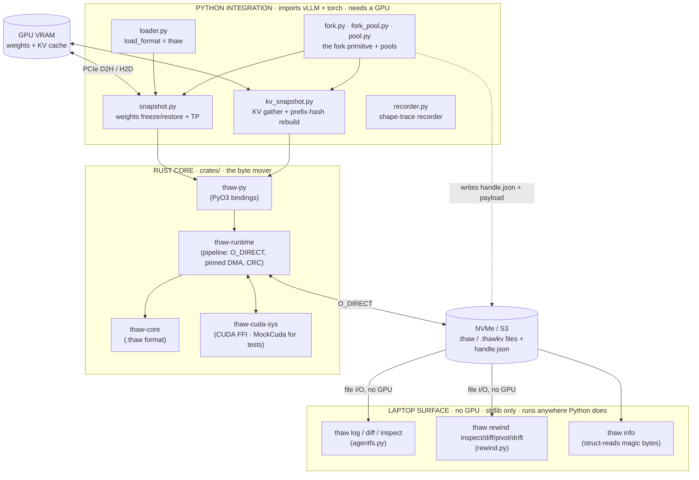
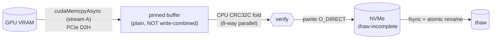
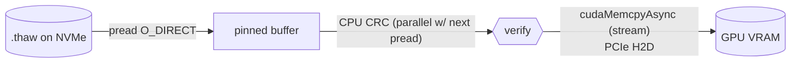

# thaw — architecture & performance model

*The mental model: what thaw is, how data flows through it, and where the wall-clock time actually goes. Built from a full code audit (every claim is grounded in `file:line`). Start here before reasoning about performance work.*

---

## TL;DR (read this first)

thaw is **three layers stacked on one file format**:

1. A **Rust core** (`crates/`) that moves bytes between GPU memory and disk as fast as the hardware allows (double-buffered, O_DIRECT, CRC-verified, pinned-memory DMA).
2. A **Python integration layer** (`python/thaw_vllm/`) that reaches into a *live* vLLM engine, pulls out its weights + KV cache + prefix-hash table, and hands them to the Rust core, or restores them back.
3. A **laptop surface** (`agentfs`, `rewind`) that reads the resulting files with **no GPU, no torch, no vLLM** — pure file I/O. This is the "git for live agent sessions" layer.

Everything is one artifact: a `.thaw` / `.thawkv` snapshot file (plus a small JSON manifest). You can produce it on a GPU, then inspect, diff, and reason about it on your Mac.

**The one-sentence performance answer:** freeze is **storage-write-bound and already near the hardware ceiling**; the fork hot-path (0.88s) and the 22s init floor are **vLLM/GPU-bound, not thaw** (thaw's win there is *amortization*, not raw speed); the **only place thaw is clearly leaving performance on the table is restore** (~1.5 GB/s against a 3–7 GB/s NVMe ceiling, so ~2× is recoverable in pure OS code); and **S3 and PCIe are hard walls** that only sharding and GPUDirect Storage respectively get past.

---

## 1. The whole system in one picture



**The single most important line in the whole system** is the boundary between the laptop surface (L) and everything below it. Inspecting and diffing a live agent session does **not** require the hardware that produced it. That is the product idea, and it is enforced in code (next section).

---

## 2. The GPU / no-GPU split line

This is enforced by a lazy-import discipline in `python/thaw_vllm/__init__.py:14-85`. Importing `thaw_vllm` must never pull in torch or vLLM; submodules are bound on first attribute access via PEP 562 `__getattr__`. The GPU stack loads only when you call a GPU verb.

```
┌───────────────────────────────────────────────────────────────────┐
│  NO GPU REQUIRED   (stdlib only — laptop, CI, no torch/vLLM)       │
│                                                                    │
│   thaw inspect        agentfs.inspect_handle()   reads handle.json │
│   thaw diff           agentfs.diff_handles()     block-hash ∩      │
│   thaw log            agentfs.log_handles()       git-graph tree   │
│   thaw rewind {inspect,diff,pivot,drift}          logprob space    │
│   thaw info           cmd_info()                  magic bytes      │
│                                                                    │
╞════════════════════════════════════════════════════════════════════╡
│  GPU REQUIRED   (imports vLLM / torch / CUDA)                      │
│                                                                    │
│   thaw freeze         LLM() + freeze_model_tp + freeze_kv_cache    │
│   thaw serve          EnginePool + uvicorn                         │
│   thaw_vllm.load()    LLM() + restore_model_tp                     │
│   fork() / hydrate()  KV/weights DMA into a running engine        │
│   Recorder.start()    wraps scheduler.schedule() on a live engine  │
└───────────────────────────────────────────────────────────────────┘
```

`agentfs` `diff` is the cleverest part of this layer: it measures shared context between two sessions **with no token IDs and no engine**, by intersecting their prefix-cache block-hash *sets* (`agentfs.py:264-265`). vLLM's block hashes are chained over token content, so two sessions sharing a prefix share an identical leading set of hashes; the size of the intersection is the shared-prefix length.

---

## 3. The file format (`.thaw` / `.thawkv`)

Everything reduces to this. All little-endian. (`crates/thaw-core/src/header.rs`, `region.rs`)

```
┌─ HEADER (4096 B, one page) ──────────────────────────────────┐
│  0   "THAW" magic                                            │
│  4   version u32 (=2)                                         │
│  8   num_regions u64                                          │
│  16  region_table_offset u64                                 │
│  24  vllm_commit (40 raw bytes, hex SHA1)                    │
│  64  reserved, zero-filled to 4096                           │
├─ REGION TABLE (num_regions × 32 B) ──────────────────────────┤
│  per entry:  kind(u32) logical_id(u32) size(u64)             │
│              file_offset(u64) crc32c(u32) reserved(u32)      │
│  kind: 0=Weights  1=KvLiveBlock  2=Metadata                  │
├─ PAYLOAD ────────────────────────────────────────────────────┤
│  regions back-to-back, each at its recorded file_offset      │
└──────────────────────────────────────────────────────────────┘
```

A fork **handle directory** is this plus a manifest:
- `handle.json` — lineage + metadata (`handle_id`, `parent_id`, `label`, `prefix_token_ids`, `block_shape`, …)
- `kv.thawkv` + `kv.thawkv.meta` — the KV payload and its sidecar (block hashes, dtype, block_size)
- `weights.thaw` — optional, only when `include_weights=True`

The laptop surface reads only `handle.json` and the `.meta` sidecar. The GPU is needed only to write or re-hydrate the payload.

---

## 4. The three core operations

### Freeze (GPU → disk)

Pipelined, double-buffered (`crates/thaw-runtime/src/pipeline.rs:767-1030`). Per chunk, the D2H copy of the *next* chunk runs concurrently with the CRC + O_DIRECT write of the *previous* one:



Bottleneck stages: **PCIe D2H** (~55 GB/s on Gen5) → **CPU CRC** (~30 GB/s parallel) → **NVMe write** (~3–7 GB/s, the actual limiter). Hard-won lesson encoded at `pipeline.rs:843-848`: freeze buffers are **plain** pinned, not write-combined, because the CPU must *read* them for CRC, and CPU reads of WC memory are ~100× slower (this was the v0.3.0 "50 MB/s freeze" bug).

### Restore (disk → GPU)

Same structure inverted (`pipeline.rs:1121+`). Per chunk, the pread of the *next* chunk and the CRC of the *previous* run in parallel via `thread::scope`, while the H2D upload is in flight:



There is also a **zero-copy path**: `PinnedMmap` registers an mmap once with `cudaHostRegister` (O(pages), ~7s for 16GB) and then every restore is pure PCIe H2D with no intermediate copy. This one-time pin is what `thaw serve` amortizes.

### Fork (the primitive)

A fork is **a read on GPU state + an NVMe write** — the parent engine is never mutated (`fork.py:513-618`). Hydrating a child is the GPU-bound step (`hydrate()`, `fork.py:308-354`). `branch()` is pure file I/O (`fork.py:263-276`) — it copies the payload and stamps a new `handle_id`/`parent_id`, which is why lineage (`thaw log`) works with no GPU.

The KV snapshot is the moat. Naively, a 4K-token trunk × 32 layers is ~16,000 tiny per-block DMAs at ~50 MB/s. `_coalesce_kv_to_gpu_buffer` (`kv_snapshot.py:146-195`) does **one `index_select` gather per layer** (32 ops) into a single contiguous GPU buffer, then a **single** ~500MB DMA that saturates NVMe — the documented 60× win. On restore, `cached_block_hash_to_block` is repopulated (`kv_snapshot.py:554-558`) so the next matching request **skips prefill entirely**.

---

## 5. ForkPool — why "0.88s per fork" is real

Without a pool, every fork pays ~340s of vLLM cold-boot (torch.compile + CUDA graphs + weights + NCCL). ForkPool pays that **once**:

```
init_pool(model, workers=N)                          ← 22.3s ONE TIME
  ├─ slot 0: spawn subprocess → LLM(...) → "ready"
  ├─ slot 1: spawn subprocess → LLM(...) → "ready"
  └─ slot N: ...

fork_completions(prompts)   ← per RL round, ~0.88s median
  ├─ fork(llm)                        snapshot KV (+weights) to disk
  └─ dispatch (ThreadPoolExecutor):
       slot 0:  hydrate → generate → reset   ┐
       slot 1:  hydrate → generate → reset   ├─ all concurrent
       slot N:  ...                          ┘
```

A warm fork has **no weight load and no disk on the hot path** — it's KV restore (~0.1–0.3s) + GPU decode of the new tokens. The 0.88s is mostly "generate 256 new tokens across 4 branches." That is near vLLM's native floor, **not** a thaw cost. (`fork_pool.py`, receipt: `site/receipts/2026-04-20_h100_fork_pool_rl.json`.)

**EnginePool** (`pool.py`) is a different beast for `thaw serve`: in-process engines, weight-only hot-swap between named fine-tunes, OpenAI API in front. No KV snapshotting.

---

## 6. Performance & the hardware ceiling (the important part)

### Validated numbers (re-validated receipts only — safe to cite)

| Operation | Hardware | Number | Source |
|---|---|---|---|
| ForkPool init (one-time) | H100 80GB, 8B | 22.3s | `site/receipts/2026-04-20_h100_fork_pool_rl.json` |
| Fork round (4 branches × 64 tok) | H100 80GB, 8B | **0.885s median** | same |
| LangGraph fan-out, warm rounds | H100 SXM, 8B, 4 reviewers | **1.43s** (64.55s cold) | `legacy-site/receipts/2026-04-21_h100_pr_review_langgraph.json` |
| Sleep/freeze 8B weights | H100 SXM TP=1 | 3.4s, **4.78 GB/s** | `site/receipts/2026-04-22_rfc/sleep_mode_8b_tp1.json` |
| Wake/restore 8B weights | H100 SXM TP=1 | 11.1s, **1.54 GB/s** | same |
| Sleep/freeze 70B weights | 2×H100 TP=2 | 16.1s, **9.04 GB/s agg** | `site/receipts/2026-04-22_rfc/sleep_mode_70b_tp2.json` |
| Wake/restore 70B weights | 2×H100 TP=2 | 53.6s, **2.78 GB/s agg** | same |
| Replay E1–E3 (research) | A100 80GB, Qwen2.5-7B | bit-identical, Δ=0.0 | `site/receipts/2026-06-12_a100_replay_e123.json` |
| S3 single-key GET (any client) | EC2 intra-region | **~135 MB/s** (flat 8→256 conc.) | `legacy-site/receipts/2026-04-23_ec2_s3_download.json` |

### Per-resource ceiling — where thaw sits

| Resource | Ceiling | thaw today | Verdict |
|---|---|---|---|
| **PCIe Gen5 D2H/H2D** | ~55–63 GB/s | 55 GB/s (slot-warm hot-swap) | **At line rate.** Only escape: NVLink/SXM-direct or GPUDirect Storage. |
| **NVMe write (freeze)** | ~3–7 GB/s/controller | 4.78 GB/s (8B), 9.04 GB/s across 2 drives (70B) | **Near ceiling.** More throughput = more drives, not better code. |
| **NVMe read → GPU (restore)** | ~3–7 GB/s/controller | **1.4–1.5 GB/s** | **Real code headroom (~2×).** DMA path dominates; mmap is ~ms. |
| **vLLM engine init** | fixed 9–22s | 17–22s | **Not thaw's code.** Only amortizable. |
| **S3 single-object GET** | ~135 MB/s (server throttle) | 135 MB/s | **Hard wall.** Only unlock: shard across N keys at freeze time. |
| **CPU read of WC-pinned mem** | ~50 MB/s | fixed (use plain pinned) | **Already won** in v0.3.1. |

### Where the wall-clock actually goes

**Cold first-load (8B, ~22s):** ~all vLLM init + weight materialize. thaw can't beat it; it amortizes it. → **vLLM-bound.**

**Warm fork (8B, 0.88s):** ~0s prefill (skipped — the whole point), KV restore small, the rest is GPU decode of 256 new tokens. → **GPU/vLLM-bound, not thaw.**

**70B freeze+restore (2×H100):** freeze 16.1s @ 9.04 GB/s (near NVMe-write ceiling) vs restore 53.6s @ 2.78 GB/s. The restore is **3.3× slower than freeze on identical hardware** — that asymmetry is not physics, it's the restore DMA path leaving NVMe read bandwidth unused. → **the freeze is near-optimal; the restore is the bug.**

### Hardware ceiling vs. code win — the brutal verdict

**Hard walls (need different hardware, not better code):**
1. PCIe Gen5 D2H at 55 GB/s — already at line rate.
2. NVMe write at 3–7 GB/s/controller — freeze is near it.
3. S3 single-object GET at ~135 MB/s — server-side throttle, no client beats it.
4. vLLM init floor (9–22s) — fixed cost in vLLM, only amortizable.

**Genuine code wins still on the table:**
1. **Restore/wake DMA path** — biggest one. Runs at 1.4–1.5 GB/s against a 3–7 GB/s ceiling. `MADV_SEQUENTIAL` + a prefetch thread should ~2× single-GPU restore. The freeze/restore asymmetry is the receipt that this is code, not physics.
2. **TP>1 restore cascade** — two O_DIRECT preads contend on one controller; the RAM-path-first fix (shared page cache, parallel reads) recovers it. Pending re-validation.
3. **S3 shard-at-freeze** — split `.thaw` across N keys so N×135 MB/s applies (4 keys ≈ 540 MB/s, 8 ≈ 1.1 GB/s). A format/code change, the *only* way past the S3 wall. A Rust client alone does **not** help.

### The multi-GPU freeze gap, clarified

The roadmap line "wire Rust pipelined freeze through `collective_rpc`" is **misleading and effectively stale**. The audit confirms each rank already runs the Rust pipeline: `_worker_freeze` → `freeze_model_pipelined` → `_thaw.freeze_to_file_pipelined` (`thaw_vllm/snapshot.py:86`, `thaw_common/snapshot.py:230`), and the aggregate is labeled `"rust_pipelined"` when all ranks agree. The 1.4 GB/s aggregate is **NVMe write contention** — two ranks writing O_DIRECT to one controller — the write-side twin of the restore-cascade bug. On single-NVMe hardware there is no clean code fix; it needs multiple drives. Don't burn a 2×H100 pod chasing it.

---

## 7. Answers to the three questions you actually asked

**"Is it slow because of vLLM?"** Partly, and that part is *fine*. The 22s init and the 0.88s warm fork are vLLM/GPU-bound; thaw's value there is making that cost a one-time fee instead of a per-call one (amortization). The part that's *thaw's* to fix is restore throughput, and it's a clean ~2× OS-level win.

**"Is the money in S3 shard-parallel?"** Technically, S3 sharding is the *only* lever that beats the S3 wall, and it's a tractable code/format change. But be honest about what it buys: faster cold downloads. The thing nobody else has is the **fork primitive + the laptop-side inspect/diff/drift** — that's the differentiated surface, and it costs no pod money to make better. Throughput is table stakes; the fork file is the moat.

**"Where's the ceiling?"** Freeze: at it. Restore: ~2× under it (code win). PCIe: at it. S3: at it unless you shard. vLLM init: not yours. The single most defensible perf win available is the restore DMA path.

---

## 8. Data-hygiene flags (found during the audit)

1. **CLAUDE.md points at the wrong receipts dir.** The LangGraph and S3 receipts it cites live in `legacy-site/receipts/`, not `site/receipts/`. If those numbers are surfaced publicly, fix the path.
2. **The 55 GB/s slot-warm hot-swap and the 70B 2.24× numbers have no committed JSON receipt** — they exist only as CLAUDE.md prose. The 55 GB/s is load-bearing (it's the only PCIe-line-rate claim thaw has). Capture a receipt next pod session, or downgrade its confidence.
3. **Retired numbers that must never resurface:** 17.2× (2×A100 70B), 9.7×/12.6×/5.9× whole-flow, 19.62/9.57 GB/s freeze. All pod-specific or unreproduced.

---

## Subsystem file map

| Area | Files |
|---|---|
| Rust format | `crates/thaw-core/src/{header,region}.rs` |
| Rust pipeline | `crates/thaw-runtime/src/{pipeline,freeze,restore,direct_io,backend}.rs` |
| Rust CUDA FFI | `crates/thaw-cuda-sys/src/lib.rs`, `crates/thaw-runtime/src/{real,mock}.rs` |
| PyO3 bindings | `crates/thaw-py/src/lib.rs` |
| Weights + TP | `python/thaw_common/snapshot.py`, `python/thaw_vllm/snapshot.py`, `python/thaw_vllm/loader.py` |
| KV + fork | `python/thaw_vllm/{kv_snapshot,fork,fork_pool,_fork_pool_worker,pool}.py` |
| Laptop surface | `python/thaw_vllm/{agentfs,rewind,recorder}.py` |
| CLI + server | `python/thaw_vllm/{cli,server}.py`, `python/thaw_vllm/__init__.py` |
