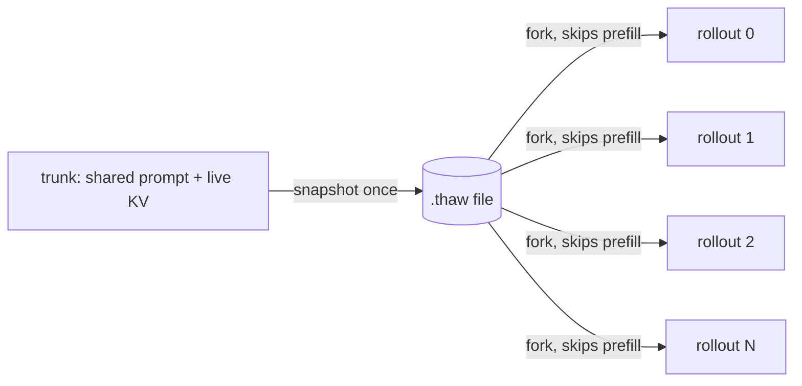
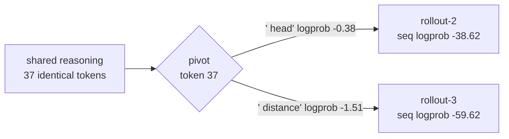

# Your RL rollouts re-run prefill on every branch. They don't have to.

If you run reinforcement learning on top of a self-hosted LLM (GRPO, best-of-N, tree search, any kind of rollout-based post-training), you have paid this tax whether you noticed it or not.

A rollout step looks like this: you have a shared prompt, the "trunk" (a system prompt, a problem statement, the reasoning so far), and you want N continuations from it. So you ask the engine for N samples. Under the hood, the engine runs a full forward pass over the entire trunk again for the branches that don't hit the prefix cache, and the moment you want to fork from a *pivot point* partway through a generation, the cache assumptions break and you re-prefill. The cost of a step is roughly `num_rollouts × prefill_time`, and prefill_time grows with context length.

HuggingFace's 2026 async-RL survey put the gap plainly:

> "DEEP-GRPO's pivot resampling requires saving KV cache state at pivot points, which no current async library supports out of the box."

That is the problem thaw solves. This post is about how.

## The idea: snapshot the live session, fork the trunk

A running vLLM session is not just the weights. It is the weights plus the KV cache (the attention state for every cached token), plus the scheduler's block table, plus the prefix-hash table that maps cached content to physical blocks. That whole bundle is what lets the engine continue a sequence cheaply. Normally it lives and dies inside GPU memory.

thaw freezes that bundle to a file:

```python
import thaw_vllm as thaw

# warm the trunk once
llm.generate(trunk_prompt, sampling_params)

# snapshot the live session to a portable handle
h = thaw.checkpoint(llm, prompt=trunk_prompt, label="trunk")
```

Now you can fork. Each child hydrates from the same snapshot and diverges from the fork point, so the trunk's prefill cost becomes a one-time copy instead of a recompute per branch. The step goes from `num_rollouts × prefill_time` to roughly `prefill_time + num_rollouts × memcpy_time`.



## "Why not just keep the raw text and re-feed it?"

This is the first question every good engineer asks, so it is worth answering directly. Two reasons.

First, cost. Re-feeding text means re-running prefill over the whole trunk on every branch. That is fine for one chatbot user. It is brutal when you fork the same long trunk hundreds of times per training step, which is exactly what rollout-based RL does.

Second, exactness. Re-prefilling from text is not bit-identical to the original run. Kernel non-determinism, batching, and chunked prefill all introduce drift, and some state is not in the text at all (the scheduler's block table, the prefix-hash table, the sampler's RNG state). For pivot resampling you want to branch from the *exact* activation state at the pivot, not an approximation you rebuilt from the transcript.

## How the snapshot actually works

The KV cache is captured at block granularity (vLLM's paged blocks, e.g. 16 tokens per block), not per token, and written with a pipelined DMA path so it streams to disk at GB/s rather than trickling out token by token. The prefix-hash table is captured alongside it, which is the part that lets a restored session keep its cached prefix instead of re-prefilling. On restore, thaw reconstructs the block table and the hash map so the engine treats the hydrated prefix as already-cached.

One honest constraint: this reaches into vLLM's V1 internals, so a `.thaw` snapshot is pinned to a vLLM version. It is not a cross-engine interchange format, it is a fast path against a specific engine. We pin the version loudly rather than pretend otherwise.

Restore is bit-identical at the fork boundary: a fresh process loads the file, restores weights and KV, and reproduces the parent's continuation exactly. We validate that on every release across multiple architectures.

## Once you have the rollouts: diff them in logprob space

Forking the trunk is half of it. The other half is making sense of what came back. When you fan out N rollouts, you usually want to know two things: where did they diverge, and which one should I keep?

`thaw rewind` answers both, and it runs on a laptop with no GPU, because a rollout is just a file (the generated tokens plus the logprob the model assigned each one).


Here is a real example: Qwen2.5-7B-Instruct, best-of-8 on one reasoning problem, captured on an A100.

```
thaw rewind pivot rollouts
  8 rollouts · trunk 93 tokens · Qwen/Qwen2.5-7B-Instruct
  first divergence at generated token 0:
    "Let"  ->  rollout-2, rollout-3, rollout-4, rollout-5
    "To"   ->  rollout-0, rollout-1, rollout-6, rollout-7
  best branch: rollout-5  (seq logprob -28.31, perplexity 1.08)
```

And the part I find genuinely useful, a diff between two branches that shared a long reasoning prefix:

```
thaw rewind diff rollouts/rollout-2 rollouts/rollout-3
  seq logprob   A -38.62 · B -59.62   (A higher by 21.00)
  pivot         generated token 37  (after 37 identical tokens)
    shared   ... Step 1: Determine the
  - A  " head"      logprob -0.38   (B ranked this #1 @ -0.38)
  + B  " distance"  logprob -1.51   (A ranked this #2 @ -1.51)
  decisiveness  A preferred its token by 1.13 logprob, a confident split
```



Two chains agreed for 37 tokens, then forked on how to set up the first step. The counterfactual is the interesting bit: branch B sampled `" distance"`, but the model actually rated branch A's token (`" head"`) as its single most likely choice (rank 1) even on B's own branch. That is the kind of thing you want to see when a reward suddenly drops and you are trying to figure out which rollout went sideways and why.

## The numbers

- Fork latency, steady state: 0.88s median per round on an H100 with Llama-3.1-8B (a pre-warmed pool holds the engine once, each fork snapshots KV only). That is roughly 400x over paying cold-boot per round.
- Restore: bit-identical at the fork boundary, validated across architectures on every release.
- rewind: validated on Qwen2.5-7B best-of-8, capture plus diff plus pivot, with the rollouts checked into the repo so you can run the analysis yourself with no GPU.

## Try it

```bash
pip install thaw-vllm

# the laptop side, no GPU: 8 real Qwen-7B rollouts are checked in
thaw rewind pivot examples/rewind-bestof8
thaw rewind diff  examples/rewind-bestof8/rollout-2 examples/rewind-bestof8/rollout-3
```

There is an interactive version you can click through in the browser (no install, no GPU): [the thaw rewind Space](https://huggingface.co/spaces/thaw-ai/thaw-rewind).

Code, receipts, and the full API are on GitHub: [github.com/thaw-ai/thaw](https://github.com/thaw-ai/thaw). It works with vLLM today (SGLang weights path validated; KV path is vLLM-only for now). It is open source, Apache-2.0.

If you run rollout-based RL and this maps onto a pain you have, I would genuinely like to hear how it does or does not fit your loop.
